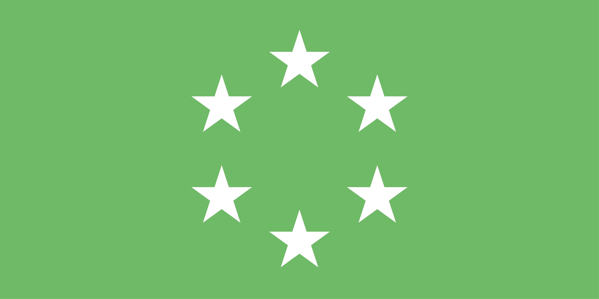

# Six Suns Federation
Sometimes known as the "Republic of Dracona"
<dl>
    <dt>Faction Code</dt><dd>SSF</dd>
    <dt>Established</dt><dd>Pre-Colonial</dd>
    <dt>Successor(s)</dt><dd><a href="ndr.html">NDR</a></dd>
    <dt>Capital System</dt><dd><a href="../systems/venture/">Venture</a></dd>
</dl>

Known to have been one of the last surviving major democracies in the Milky Way, the SSF today is remembered for their robust economy and high standard of living - factors that would eventually trickle down to the modern day [New Draconic Republic](./ndr.html)

Surviving SSF ships are also highly prized, with the Federation Navy having composed hundreds of purpose-built designs intended to suit specific roles in a fleet. Without the extensive maintenance infrastructure of their time however, the vast majority of these ships have struggled to last.

## History
The SSF were one of the primary partners of the [CAS] during the early colonisation of Dracona, eventually negotiating a deal to control the some of the first systems discovered in the cluster - including [Venture] (where the gate to the Milky Way was located), [Altas], [Doradus], and [Ares], as well as [Hypnos Organa] and [Hypnos Aria] (although these last two went by different names that have since been lost to time).

In 21 BGC the Federation is noted to have taken in vast numbers of refugees from the collapse of the [CAS].

The SSF managed to remain out of any major conflicts until 5 AGC when the Federation entered into a precarious alliance with the [ISC] in an attempt by the two powers to work together in preventing the [Frontier Civil War] from spreading past the [Myca] straight.

Near the end of the [Frontier Civil War], the SSF in conjunction with the [ISC] would attempt to capture the frontier - beginning the [Frontier Independence War] in 14 AGC. By 21 AGC however, with the withdrawal of the [ISC] and facing heavy opposition from the [DFU] and [Free Helion Peoples](./fhc.html) would eventually sign a truce and end the war in 31 AGC.

The SSF would again see conflict with the rise of the [SNC] and the beginning of the [First SNC Crusade] in 67 AGC. The sudden conflict would greatly damage the SSF, with the peace treaty resulting in the loss of the [Hypnos Organa] and [Hypnos Aria] systems and inflicting heavy losses on the Federation Navy.

By the start of the [Second SNC Crusade] in 153 AGC, the SSF was beginning to face internal political struggles - with the population becoming more and more unwilling to fight such a destructive war. When the conflict ended in 164 AGC, the SSF had lost another system - [Ares] and was severely weakened.

The Federation would soon formally dissolve within Dracona, reforming into the [NDR].

----

[CAS]: ./cas.html
[ISC]: ./isc.html
[DFU]: ./dfu.html
[SNC]: ./snc.html
[NDR]: ./ndr.html

[Venture]: ../systems/venture/
[Atlas]: ../systems/atlas/
[Doradus]: ../systems/doradus/
[Ares]: ../systems/ares/
[Hypnos Organa]: ../systems/hypnos_organa
[Hypnos Aria]: ../systems/hypnos_aria

[Frontier Independence War]: ../history/conflicts/frontier_independence_war.html
[Frontier Civil War]: ../history/conflicts/frontier_civil_war.html
[First SNC Crusade]: ../history/conflicts/first_snc_crusade.html
[Second SNC Crusade]: ../history/conflicts/second_snc_crusade.html