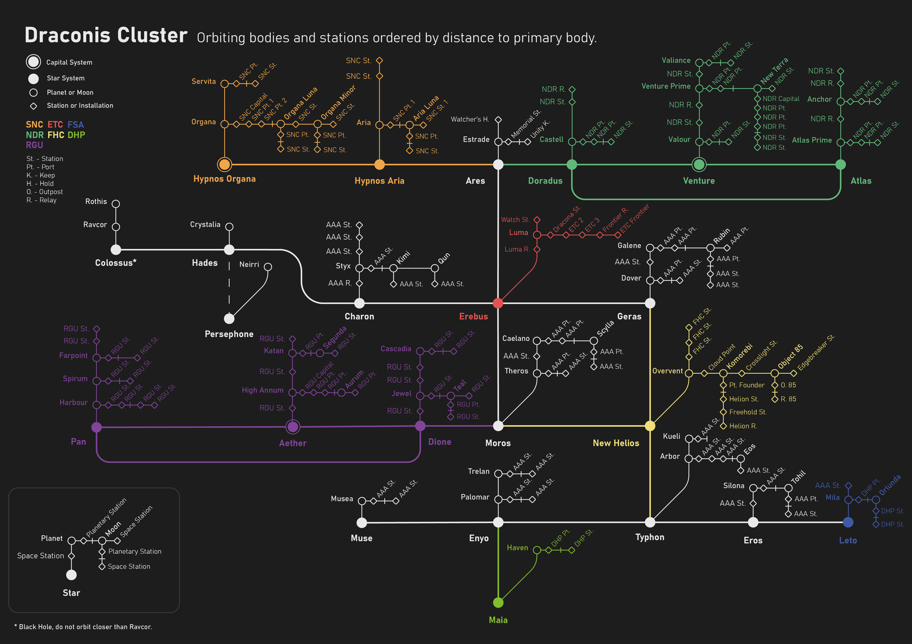

# The Draconis Cluster
Often alterantively known as "Dracona", the cluster is a collection of stars in the the Large Magellanic Cloud dwarf galaxy. It is comprised of 23 systems often split into regions based on astro-geographic and political divisions.

## Systems by Region
### Stellar North
* [Hypnos Organa](./hypnos_organa/)
* [Hypnos Aria](./hypnos_aria/)
* [Ares](./ares/)
* [Doradus](./doradus/)
* [Venture](./venture/)
* [Atlas](./atlas/)

### Stellar West
* [Colossus](./colossus/)
* [Hades](./hades/)
* [Persephone](./persephone/)
* [Charon](./charon/)

### Stellar Core
* [Erebus](./erebus/)
* [Geras](./geras/)
* [Moros](./moros/)
* [New Helios](./new_helios/)

### Stellar South
* [Pan](./pan/)
* [Aether](./aether/)
* [Dione](./dione/)

### Frontier
* [Muse](./muse/)
* [Enyo](./enyo/)
* [Maia](./maia/)
* [Typhon](./typhon/)
* [Eros](./eros/)
* [Leto](./leto/)

## List of Planets and Moons (A-Z)
In total there are 50 known planets and moon in the Draconis Cluster.
### Planets
In total there are 36 known planets in the Draconis Cluster.
 - Anchor
 - Arbor
 - Aria
 - Atlas Prime
 - Caelano
 - Cascadia
 - Castell
 - Crystalia
 - Dover
 - Estrade
 - Farpoint
 - Galene
 - Harbour
 - Haven
 - High Annum
 - Jewel
 - Katan
 - Kueli
 - Luma
 - Mila
 - Musea
 - Neirri
 - Organa
 - Overvent
 - Palomar
 - Ravcor
 - Rothis
 - Servita
 - Silona
 - Spirum
 - Styx
 - Theros
 - Trelan
 - Valiance
 - Valour
 - Venture Prime

### Moons
In total there are 16 known moons in the Draconis Cluster.
 - Aria Luna
 - Aurum
 - Eos
 - Kimi
 - Komorebi
 - New Terra
 - Object 85
 - Organa Luna
 - Organa Minor
 - Orlunda
 - Qun
 - Rubin
 - Scylla
 - Segunda
 - Teal
 - Tohil

----
